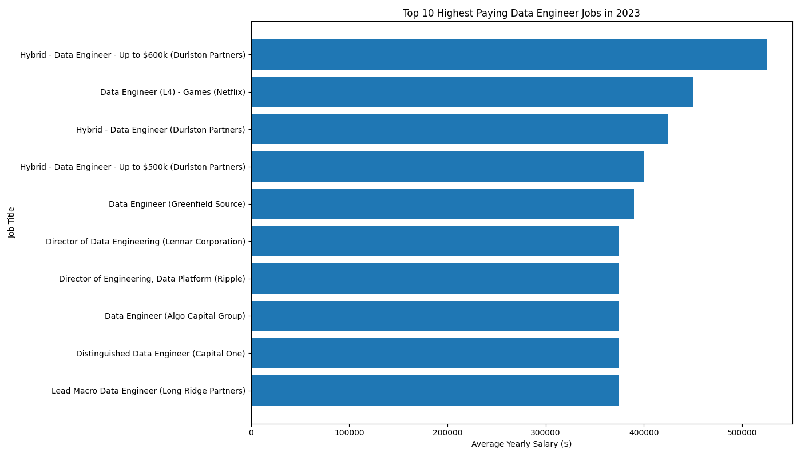
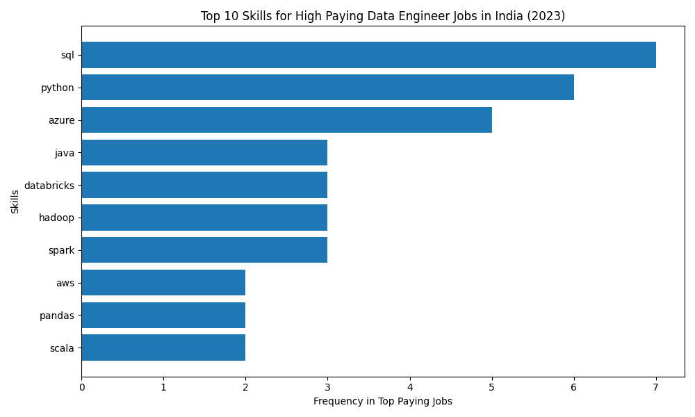

# Introduction
📊 Dive into the data job market! Focusing on Data Engineer roles, this project explores 💸 top-paying jobs, 🔥 in-demand skills, and 📈 where high demand meets high salary in Data Enginnering.    
💡  
🔍 SQL Quires? Check them out here : [project_sql folder](/project_sql/)

# Background
Driven by a quest to navigate the data engineer job market more effectively, this project was born from a desire to pinpoint top-paid and in-demand skills, streamlining others work to find optimal jobs.


### The questions I wanted to answer through my SQL queries were:

1. What are the top-paying data analyst jobs?
2. What skills are required for these top-paying jobs?  
3. What skills are most in demand for data analysts?  
4. Which skills are associated with higher salaries?  
5. What are the most optimal skills to learn?

# Tools I Used
For my deep dive into the data analyst job market, I harnessed the power of several key tools:
  - **SQL:** The backbone of my analysis, allowing me to query the database and unearth critical insights.
  - **PostgreSQL:** The chosen database management system, ideal for handling the job posting data.
  - **Visual Studio Code:** My go-to for database management and executing SQL queries.
  - **Git & GitHub:** Essential for version control and sharing my SQL scripts and analysis, ensuring collaboration and project tracking.

# The Analysis

Each query for this project aimed at investigating specific aspects of the data analyst job market. Here’s how I approached each question:

**1. Top Paying Data Analyst Jobs**

To identify the highest-paying roles, I filtered data analyst positions by average yearly salary and location, focusing on remote jobs. This query highlights the high paying opportunities in the field
```sql
SELECT 
    job.job_id as job_id,
    job.job_title as job_title,
    company.name as company_name,
    job.job_location as job_location,
    job.salary_year_avg as salary,
    job.job_posted_date as posted_date,
    job.job_schedule_type as schedule_type
FROM 
    job_postings_fact job
LEFT JOIN 
    company_dim company
ON 
    job.company_id= company.company_id
WHERE 
    job.job_title_short='Data Engineer'
AND 
    job.salary_year_avg IS NOT NULL
ORDER BY 
    salary DESC
LIMIT 10;
```
Here's the breakdown of the top data analyst jobs in 2023:

  - **Wide Salary Range:** Top 10 paying data analyst roles span from $184,000 to $650,000, indicating significant salary potential in the field.
  - **Diverse Employers:** Companies like SmartAsset, Meta, and AT&T are among those offering high salaries, showing a broad interest across different industries.
  - **Job Title Variety:** There's a high diversity in job titles, from Data Analyst to Director of Analytics, reflecting varied roles and specializations within data analytics.

  
*Bar graph visualizing the salary for the top 10 salaries for data engineer; ChatGPT generated this graph from my SQL query results*

## 2. Skills for Top Paying Jobs
To understand what skills are required for the top-paying jobs, I joined the job postings with the skills data, providing insights into what employers value for high-compensation roles.

```sql
WITH high_paying_jobs AS
(
SELECT 
    job.job_id as job_id,
    job.job_title as job_title,
    company.name as company_name,
    job.job_location as job_location,
    job.salary_year_avg as salary,
    job.job_posted_date as posted_date,
    job.job_schedule_type as schedule_type
FROM 
  job_postings_fact job
LEFT JOIN 
  company_dim company
ON 
  job.company_id= company.company_id
WHERE 
  job_title_short='Data Engineer'
AND 
  job_country ='India'
AND  
  salary_year_avg IS NOT NULL
ORDER BY 
  salary DESC
LIMIT 10
)
SELECT  high_paying_jobs.*,
    skills as skills_name 
FROM 
  skills_dim skill
JOIN 
  skills_job_dim sk
ON 
  sk.skill_id=skill.skill_id
JOIN 
  high_paying_jobs 
ON 
  high_paying_jobs.job_id = sk.job_id
ORDER BY 
  salary DESC
  ```
Here's the breakdown of the most demanded skills for the top 10 highest paying data enginerr jobs in 2023 in India:
  1. SQL
  2. Python
  3. Spark / PySpark
  4.Cloud (Azure / AWS)
  5. Databricks
  6. Data Pipeline Engineering


*Bar graph visualizing the count of skills for the top 10 paying jobs for data analysts; ChatGPT generated this graph from my SQL query results*

## 3.In-Demand Skills for Data Analysts
This query helped identify the skills most frequently requested in job postings, directing focus to areas with high demand.

```sql
SELECT 
    skills as skill_name,
    count(sk.job_id) as demand_count
From 
    job_postings_fact j
Join 
    skills_job_dim sk
ON 
    j.job_id= sk.job_id
Join 
    skills_dim s
ON 
    s.skill_id=sk.skill_id
WHERE 
    job_title_short='Data Engineer'
GROUP BY 
    skills 
ORDER BY 
    demand_count DESC
Limit 10
```
Here's the breakdown of the most demanded skills for data engineer in 2023

  - **SQL** and **Python** remain fundamental, These are must-have for Data Engineer.
  - **AWS**, **Azure** - Cloud skills now mandatory for high paying roles
  - **Spark**,**Kafka**, **Hadoop**,**Scala**, **Databricks** -Big data skills required for high paying job in Data Engineer Role.

  | Skill | Demand Count |
|-------|--------------|
| SQL | 113,375 |
| Python | 108,265 |
| AWS | 62,174 |
| Azure | 60,823 |
| Spark | 53,789 |

*Table of the demand for the top 5 skills in data analyst job postings*

## 4. Skills Based on Salary
Exploring the average salaries associated with different skills revealed which skills are the highest paying.
```sql

SELECT skills,
   ROUNd(avg(salary_year_avg),0) as avg_salary
FROM 
    job_postings_fact j
INNER JOIN 
    skills_job_dim sk
ON 
    j.job_id=sk.job_id
INNER JOIN 
    skills_dim s
ON 
    sk.skill_id=s.skill_id
WHERE 
    job_title_short='Data Engineer'
AND 
    salary_year_avg IS NOT NULL
GROUP BY 
    skills
ORDER BY 
    avg_salary DESC
LIMIT 25;
```
Here's a breakdown of the results for top paying skills for Data Engineer:

  - **Big Data & Distributed Systems:** MongoDB, Cassandra, Rust drive higher salaries
  - **Software Engineering Skills:** Node, Vue, Clojure increase earning potential
  - **Cloud & DevOps Skills:** CodeCommit, Ubuntu support high-paying roles

### These technologies are used for:

  - Large-scale data processing
  - Distributed systems
  - High-performance pipelines

| Skill | Average Salary ($) |
|-------|--------------------|
| Node | 181,862 |
| Mongo | 179,403 |
| ggplot2 | 176,250 |
| Solidity | 166,250 |
| Vue | 159,375 |
| CodeCommit | 155,000 |
| Ubuntu | 154,455 |
| Clojure | 153,663 |
| Cassandra | 150,255 |
| Rust | 147,771 |
*Table of the average salary for the top 10 paying skills for data engineer*
### Modern High-Paying Data Engineers are no longer just:
  - SQL
  - Python

## 5. Most Optimal Skills to Learn
Combining insights from demand and salary data, this query aimed to pinpoint skills that are both in high demand and have high salaries, offering a strategic focus for skill development.

```sql

SELECT 
    skills_dim.skill_id,
    skills_dim.skills,
    COUNT(skills_job_dim.job_id) AS demand_count,
    ROUND(AVG(job_postings_fact.salary_year_avg), 0) AS avg_salary
FROM job_postings_fact
INNER JOIN skills_job_dim ON job_postings_fact.job_id = skills_job_dim.job_id
INNER JOIN skills_dim ON skills_job_dim.skill_id = skills_dim.skill_id
WHERE
    job_title_short = 'Data Engineer'
    AND salary_year_avg IS NOT NULL
    AND job_work_from_home = True 
GROUP BY
    skills_dim.skill_id
HAVING
    COUNT(skills_job_dim.job_id) > 10
ORDER BY
    demand_count DESC,
    avg_salary  DESC
LIMIT 25;
```
### Most Optimal Skills for Data Engineers (2023)

| Skill ID | Skills | Demand Count | Average Salary ($) |
|----------|--------|--------------|--------------------|
| 213 | kubernetes | 56 | 158,190 |
| 98 | kafka | 134 | 150,549 |
| 3 | scala | 113 | 141,777 |
| 92 | spark | 237 | 139,838 |
| 95 | pyspark | 64 | 139,428 |
| 96 | airflow | 151 | 138,518 |
| 4 | java | 139 | 138,087 |
| 97 | hadoop | 98 | 137,707 |
| 2 | nosql | 93 | 136,430 |
| 80 | snowflake | 202 | 134,373 |

### Big Data & Streaming Skills Lead Highest Salaries
Skills like Kafka (134 demand, $150,549 avg), Spark (237 demand, $139,838 avg), and Scala (113 demand, $141,777 avg) offer both high salaries and strong demand, making them highly optimal for Data Engineers.

### Cloud & Data Platform Technologies
Tools such as Snowflake (202 demand, $134,373 avg), Airflow (151 demand, $138,518 avg), and Kubernetes (56 demand, $158,190 avg) show strong salaries with growing demand, highlighting the importance of cloud-native data engineering.

### Programming & Distributed Systems
Languages like Java (139 demand, $138,087 avg) and Scala (113 demand, $141,777 avg) remain valuable for building scalable distributed data systems

## What I Learned

Through this project, I gained hands-on experience in analyzing Data Engineer job market trends using SQL and data analysis techniques. Key learnings include:

- Learned how to analyze large datasets using SQL
- Identified top-paying Data Engineer roles and required skills
- Discovered most in-demand skills such as SQL, Python, AWS, and Spark
- Analyzed which skills are associated with higher salaries
- Compared demand count vs average salary to identify optimal skills
- Practiced using CTEs, joins, aggregations, and filtering in SQL
- Improved data cleaning and transformation skills
- Created insights from raw job posting data
- Built data visualizations to communicate findings effectively

This project helped me better understand the Data Engineer job market and the most valuable skills to focus on for career growth.

## Insights

From the analysis, several key insights emerged:

- Top-Paying Data Engineer Skills: Skills like Kubernetes ($158,190), Kafka ($150,549), and Scala ($141,777) command the highest salaries, highlighting the premium placed on distributed systems and real-time data processing expertise.
- Most In-Demand Skills: SQL (568 demand) and Python (535 demand) remain the most sought-after skills, making them foundational for anyone pursuing a Data Engineer role.
- Cloud & Data Platform Technologies: Cloud tools such as AWS (367 demand), Azure (254 demand), and Snowflake (202 demand) show strong demand and competitive salaries, emphasizing the industry's shift toward cloud-based data engineering.
- Big Data & Streaming Technologies: Technologies like Spark, Hadoop, Airflow, and Kafka appear frequently in high-paying roles, indicating the growing need for scalable data pipelines and real-time processing.
- Optimal Skills for Market Value: Skills that balance both demand and salary—such as Spark, Kafka, Airflow, and Snowflake—offer the best opportunities for career growth and higher earning potential.

## Closing Thoughts

This project helped me strengthen my SQL and data analysis skills while gaining a deeper understanding of the Data Engineer job market. By analyzing demand and salary trends, I identified the most valuable skills to focus on for career growth. The findings highlight that combining foundational skills like SQL and Python with cloud and big data technologies significantly increases job opportunities and earning potential. As this is my first project, it also improved my ability to extract insights from real-world datasets and present them effectively. This experience reinforced the importance of continuous learning and staying updated with evolving data engineering technologies.